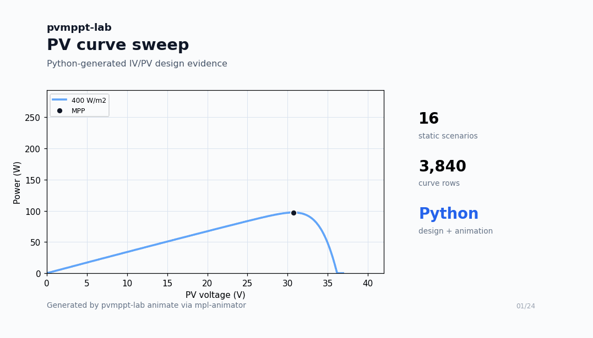
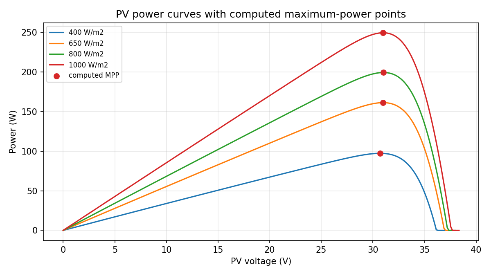
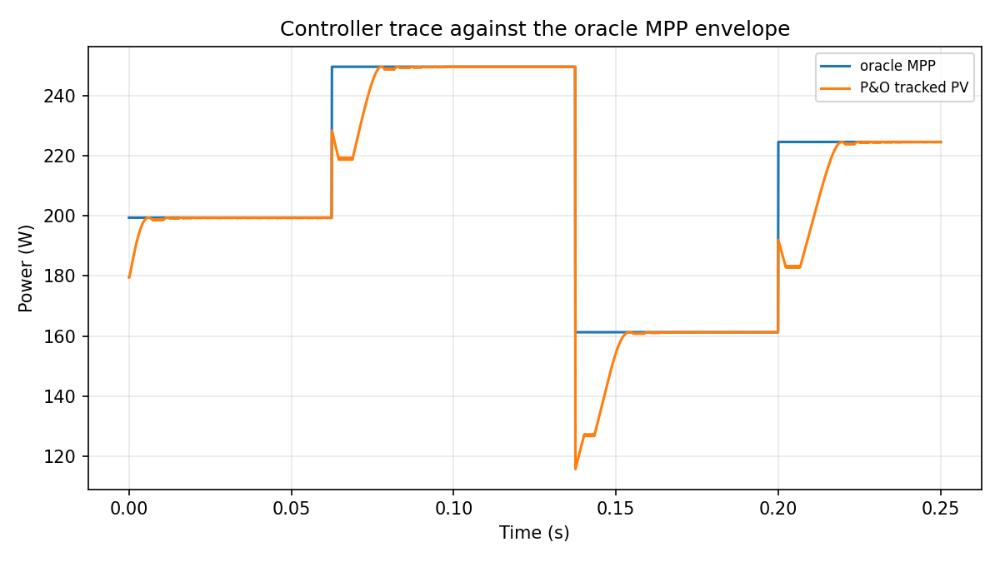

# pvmppt-lab



`pvmppt-lab` is a Python-only reproducible PV module, converter, and MPPT experiment SOP for B2B/B2Pro engineering teams.

It gives practitioners a Python toolkit that turns datasheet-style PV module specs, array assumptions, converter references, and controller settings into regenerated evidence: CSV traces, JSON metrics, plots, animations, reports, tests, and a clean public release payload.

## Commercial Value

| Buyer | Why they care | What they can reuse |
| --- | --- | --- |
| PV R&D teams | Compare PV and MPPT behavior without a heavy plant-design workflow. | Static I-V/P-V sweeps, MPP tables, reproducible scenario metrics. |
| Power-electronics engineers | Review controller changes before hardware or switched simulation work. | P&O MPPT traces, duty-cycle behavior, oracle-vs-tracked energy comparison. |
| Technical consultants | Give clients evidence that can be rerun and reviewed. | Markdown/HTML report, generated plots, CSV/JSON artifact pack. |
| Training labs and educators | Teach PV/MPPT workflows with inspectable code and deterministic outputs. | A compact SOP with tests and CI-ready commands. |

The product is not a consumer solar calculator. It is a reusable engineering workflow for teams that need assumption auditability, experiment repeatability, and reviewable artifacts.

## What It Produces

| Output | Purpose |
| --- | --- |
| Static PV curves | Show how irradiance and temperature move the operating curve and MPP. |
| Module design pack | Turn a datasheet-style module spec into I-V/P-V curves, MPP tables, sensitivity data, array scaling, plots, and a report. |
| MPPT trace | Show how the controller tracks the oracle MPP envelope over time. |
| Metrics JSON | Preserve benchmark numbers for reviews, CI, and release notes. |
| CSV data | Let another engineer rerun, plot, or audit every result. |
| GIF/MP4 animations | Animate PV sweeps, MPPT tracking, converter duty, and 3D PV surfaces through `mpl-animator`. |
| Markdown/HTML report | Package the run as a shareable engineering record. |
| Public export | Build a GitHub-ready source tree with release checks. |

## Python-Only Design Workflow

For new PV module design work, start from a module spec instead of a proprietary model file:

```bash
conda run -n dl python -m pvmppt_lab.cli design-module --spec docs/examples/trina-module.yaml --output runs/design
conda run -n dl python -m pvmppt_lab.cli validate-module --spec docs/examples/trina-module.yaml --backend internal --output runs/validation
conda run -n dl python -m pvmppt_lab.cli fit-module --datasheet docs/examples/trina-module.yaml --method desoto --output runs/fitted
```

The design path emits `design_summary.json`, `iv_pv_curves.csv`, `mpp_table.csv`, `sensitivity.csv`, array curves, plots, and a Markdown report. The default backend is an internal NumPy/SciPy single-diode solver; optional `pvlib` validation is available through the `standard` extra.

## Python Replacement Coverage

The `reproduce` command runs Python replacement suites for the local model families. Local `.mdl`, `.slx`, and `.m` files are audit inputs only; public results are generated by Python commands and do not require proprietary simulator runtimes, Specialized Power Systems, or SPICE.

| Suite | Python replacement workflow | Generated evidence |
| --- | --- | --- |
| `pv-cell` | Single-diode PV cell, MPP extraction, irradiance/temperature/Rs/Rsh/Is sweeps. | Cell I-V/P-V CSVs, MPP table, parameter sweep table, plots. |
| `pv-module` | PV module I-V/P-V equations for block-diagram and single-diode physical-parameter presets. | Module curves, module MPP table, comparison plots. |
| `pv-array` | Series/parallel array scaling, configured PV panel behavior, Trina 10s4p reference array. | Array curves, array MPP table, scaling plots. |
| `mppt` | P&O duty update, filtered voltage/current behavior, fixed and dynamic irradiance traces. | MPPT trace CSVs, duty/power/voltage/irradiance plots. |
| `converter` | Buck-boost pulse/duty reference calculations and ideal inverting output envelope. | Converter reference table, duty/output plot, metrics JSON. |
| `animate` | `mpl-animator` GIF/MP4 rendering from the same generated artifacts. | Animation manifest, generated script, GIF/MP4 outputs. |

## Reproduction Benchmark

These numbers come from `pvmppt-lab reproduce --suite all` and document the default reproduction run, not a universal performance claim.

| Metric | Result | What it means |
| --- | ---: | --- |
| Runnable model assets inventoried locally | 14 | 11 model diagrams, 2 archive diagrams, and 1 MPP script in the source asset set. |
| Completed reproduction suites | 5 | PV cell, PV module, PV array, MPPT, and converter suites all generated artifacts. |
| PV cell parameter sweeps | 20 rows | Irradiance, temperature, Rs, Rsh, and saturation-current sensitivity. |
| Motahhir-style module MPP | 79.63 W | Python reproduction of the module-level P-V maximum. |
| Trina 10s4p array MPP | 9,980.55 W | Python reproduction of the array-scale reference model. |
| Fixed 500 W/m2 MPPT efficiency | 95.77% | P&O tracked energy versus oracle MPP for the fixed source scenario. |
| Converter reference rows | 7 | Duty-cycle points for the ideal buck-boost reference envelope. |

## Demo Benchmark

These numbers are generated by `pvmppt-lab compare` and remain available as the compact public demo benchmark.

| Metric | Result | What it means |
| --- | ---: | --- |
| Static scenarios | 16 | Four irradiance levels by four temperature levels. |
| Static curve rows | 3,840 | Raw plotted PV samples available as CSV. |
| Datasheet MPP error | -0.138% | Model reference at STC versus module datasheet `Pmp`. |
| Oracle MPP energy | 52.48 J | Best achievable energy over the dynamic demo window. |
| P&O tracked PV energy | 51.27 J | Energy captured by the controller demo. |
| Tracking efficiency | 97.69% | Tracked energy divided by oracle MPP energy. |
| 98% convergence time | 0.0035 s | Time to reach the convergence threshold in the demo run. |

## Generated Results



The P-V plot shows the generated power curves at `25 C` across irradiance levels. Red markers are computed maximum-power points, so the chart explains what the static benchmark is measuring.



The MPPT trace compares the controller output against the oracle MPP envelope. The table above turns the same trace into reviewable benchmark numbers.

## Market Position

`pvmppt-lab` is complementary to established PV tools, not a replacement for full project design, finance, weather, or shading platforms.

| Tool | Strong fit | Where `pvmppt-lab` fits beside it |
| --- | --- | --- |
| [pvlib](https://github.com/pvlib/pvlib-python) | Open PV performance modeling functions and workflows. | Adds a compact controller/converter SOP and generated evidence pack. |
| [SAM](https://github.com/NREL/SAM) | Renewable-energy project simulation and techno-economic modeling. | Focuses on fast, code-reviewable PV/MPPT experiments before broader project analysis. |
| [PVsyst](https://www.pvsyst.com/en/products/pvsyst/) | Detailed PV project design, sizing, losses, databases, and reports. | Gives engineering teams a lightweight reproducible controller lab. |

## Install

Use the `dl` conda environment on this Mac:

```bash
conda run -n dl python -m pip install -e '.[dev]'
```

The package uses `numpy`, `scipy`, `pandas`, `matplotlib`, `pillow`, `pyyaml`, and `mpl-animator`. `pvlib` is optional for reference validation and is not required for the core demo.

Optional reference-validation install:

```bash
conda run -n dl python -m pip install -e '.[standard,dev]'
```

## Quick Start

Inventory runnable model assets:

```bash
conda run -n dl python -m pvmppt_lab.cli audit-models --output runs/model-audit
```

Design and validate a PV module from a datasheet-style spec:

```bash
conda run -n dl python -m pvmppt_lab.cli design-module --spec docs/examples/trina-module.yaml --output runs/design
conda run -n dl python -m pvmppt_lab.cli validate-module --spec docs/examples/trina-module.yaml --backend internal --output runs/validation
conda run -n dl python -m pvmppt_lab.cli fit-module --datasheet docs/examples/trina-module.yaml --method desoto --output runs/fitted
```

Reproduce every engineering model suite with Python:

```bash
conda run -n dl python -m pvmppt_lab.cli reproduce --suite all --output runs/reproduction
conda run -n dl python -m pvmppt_lab.cli report --run-dir runs/reproduction
```

Run static PV sweeps:

```bash
conda run -n dl python -m pvmppt_lab.cli run-static --output runs/static-demo
```

Run the MPPT demo:

```bash
conda run -n dl python -m pvmppt_lab.cli run-mppt --output runs/mppt-demo
```

Compare static and dynamic behavior, then generate a report, animations, and README assets:

```bash
conda run -n dl python -m pvmppt_lab.cli compare --output runs/comparison-demo
conda run -n dl python -m pvmppt_lab.cli report --run-dir runs/comparison-demo
conda run -n dl python -m pvmppt_lab.cli animate --preset all --run-dir runs/comparison-demo --output-dir runs/comparison-demo/animations
conda run -n dl python -m pvmppt_lab.cli build-readme-assets --run-dir runs/comparison-demo --output-dir docs/assets
```

Animate any compatible matplotlib script with the same backend:

```bash
mpl-animator my_plot.py --var freq --range "1,50" --frames 60 --out my_plot.gif
conda run -n dl python -m pvmppt_lab.cli animate-script my_plot.py --var freq --range "1,50" --frames 60 --format gif --out runs/my_plot.gif
```

GIF output is the default. MP4 output is supported when `ffmpeg` is installed and available on `PATH`.

Check release readiness and export the public GitHub payload:

```bash
conda run -n dl python -m pvmppt_lab.cli release-check
conda run -n dl python -m pvmppt_lab.cli export-public --output runs/public-release/pvmppt-lab --init-git
```

## Reference Presets

The v1 toolkit includes named Python reference presets for the default demo:

- Trina Solar TSM-250PA05.08 PV module, configured as a 10-series by 4-parallel array.
- P&O controller with `DeltaD=0.001`, duty clamp `0..0.8`, `1e-4 s` sample time, and `1e-3 s` filter time constant.
- Open-loop switched buck-boost constants for later high-fidelity work, including `48 V` source, `0.0001 s` pulse period, `5/95%` pulse widths, `0.01e-3 H` inductor, `2200e-6 F` capacitor, and `100 ohm` load.

## Validation

```bash
conda run -n dl pytest
conda run -n dl python -m pvmppt_lab.cli release-check
```

## Current Limits

- The converter is an averaged boost/load-reflection model, not a switched SPICE model.
- Full plant design, weather-file processing, shading, finance, BOM, and proposal workflows are outside v1.
- The benchmark table documents this repository's default demo. It does not claim broad algorithm leadership.
